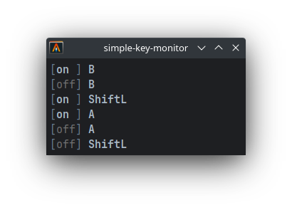

# simple-key-monitor

A simple key monitor that prints the key code of the pressed key.



## Install

### on linux

You need to install dependencies of libuiohook:

- libx11-dev
- libxtst-dev
- libxt-dev
- libxinerama-dev
- libx11-xcb-dev
- libxkbcommon-dev
- libxkbcommon-x11-dev
- libxkbfile-dev

apt install command:

```
sudo apt-get install libx11-dev libxtst-dev libxt-dev libxinerama-dev libx11-xcb-dev libxkbcommon-dev libxkbcommon-x11-dev libxkbfile-dev
```

And now you can install simple-key-monitor with the following installer or cargo.

```shell
# standalone installer
curl --proto '=https' --tlsv1.2 -LsSf https://github.com/nahco314/simple-key-monitor/releases/latest/download/simple-key-monitor-installer.sh | sh

# cargo
cargo install --git https://github.com/nahco314/simple-key-monitor
```

### on mac

On mac, there is no need to install dependencies.

```shell
# standalone installer
curl --proto '=https' --tlsv1.2 -LsSf https://github.com/nahco314/simple-key-monitor/releases/latest/download/simple-key-monitor-installer.sh | sh

# cargo
cargo install --git https://github.com/nahco314/simple-key-monitor
```

### on Windows

Windows support is WIP.

## Usage

Just run `simple-key-monitor`.

If you are using alacritty (on linux), you can display a clean GUI with a command like the following:

```shell
alacritty \
    -T simple-key-monitor \
    --class simple-key-monitor \
    -o "window.dimensions = { columns = 30, lines = 6 }" \
    -e sh -c "stty -echo && printf \"\e[?25l\" && simple-key-monitor"
```
